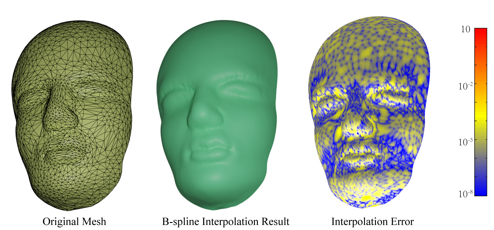

# Scattered Points Interpolation with Globally Smooth B-Spline Surface using Iterative Knot Insertion

The implementation of the paper "Scattered Points Interpolation with Globally Smooth B-Spline Surface using Iterative Knot Insertion". 

## Introduction
Our algorithm generates a single B-spline surface patch which interpolates the given scattered 3d data points. The inputs are the scattered 3d data points and their parametrization (in domain [0, 1] x [0, 1]). The output is the generated B-spline surface.

The advantage of our algorithm is that the input data points do not need to be distributed in rows or in grid points (like tranditional interpolation methods always do), but can be scattered, non-uniformly distributed. The generated surfaces, as they are interpolation surfaces, can often maintain a high precision in shape reconstruction, and, often use less control points, thanks to the Proposition we proposed and proved in our paper.

The code is implemented in C++, containing functions for B-spline basis calculation, knot vector generation, thin-plate energy calculation, control points solving, and, some polynomial operators(+, -, x, /, differential, integration, etc.). We also have some other interpolation/ approximation algorithms implemented in our code. We hope the code can help the users feel convient and comfortable to use B-splines. 

This code is tested on Windows and Linux, and it probably works on Mac.

## Build

Before build the code, you need to have CMake installed on your machine. To build the library and executable benchmark on Linux or macOS run:

```sh
mkdir build
cd build
cmake .. -DCMAKE_BUILD_TYPE=Release
make
```

## Usage

To interpolate scattered data points, just do:
```sh
#include <sparse_interp/Types.hpp>
```
Then, you can access the classes `Bcurve` and `Bsurface`. We have a tutorial example in `app/example.cpp` telling you how to initialize the classes, how to solve the interpolation surface, how to convert the B-spline surface into a triangular mesh, etc. You can read our paper for more details:

```bibtex
@article{Jiang:2022:Scattered,
    title        = {Scattered Points Interpolation with Globally Smooth B-Spline Surface using Iterative Knot Insertion},
    author       = {Xin Jiang and Bolun Wang and Guanying Huo and Cheng Su and Dong-Ming Yan and Zhiming Zheng},
    year         = 2022,
    month        = forthcoming,
    journal      = {Computer-Aided Design},
    volume       = forthcoming,
    number       = forthcoming,
    articleno    = forthcoming,
    numpages     = forthcoming
}
```
## Examples in our paper

We provide some functions to run the results shown in our paper.

1. Benchmark models 
```bash
./Sparse_Interp_bin benchmarks delta per nbr outpath
```
where `delta` and `per` are two input parameters, ranging from 0 to 1, we recommand that `delta = 0.9` and `per = 0.5`. `nbr` is the number of sampled points, we suggest to choose a number no more than 500. `outpath` is the output path. For example, on Windows, you can run `./Sparse_Interp_bin benchmarks 0.9 0.5 100 C:\\`.


2. Mesh models 
Similarly, you can get the 2 mesh model interpolation results in the paper by running

```bash
./Sparse_Interp_bin meshes modelname outpath
```
where `modelname` choose between `mask3kf.obj` and `tiger.obj`. For example, run  `./Sparse_Interp_bin meshes mask3kf.obj C:\\`.

3. Reproduction of local non-smoothness
You can run the results of Figure 7 in the paper, by
```bash
./Sparse_Interp_bin reproduce outpath
```
It will reproduce the non-smoothness problem by inserting a lot of redundant knots into a fine surface, and reduce local energy by inserting knots to regions with large energy.

4. Fixing local non-smoothness caused by too few data points
You can run the results of Figure 7 in the paper, by
```bash
./Sparse_Interp_bin local_energy outpath
```
It will produce the results in Figure 9.

5. The Outputs of the examples

After running the code, in `outpath` there will be a interpolation surface in `.obj` format, and for each interpolation surface, there is a corresponding `.csv` file recording its runtime, maximal interpolation error, and the number of control points. After running the benchmarks, the 6 benchmark models: Peak, Drop, Hyperbolic, Sinus, Bilinear and Snail will be output into `outpath`. After running the results in Figure 7 and Figure 9, the maximal energy for each iteration will also be written into the `.csv` files.

## Contact

The code is far from being perfect, i.e. solving stability problem for large amount of data points. If you have problem using our code, or you have a bug to report, please contact us by `wangbolun@buaa.edu.cn`, or post an issue on GitHub. We'd appreciate to have your contribution. If you are using our code in your projects, please contact us and briefly tell us what you use it for. That will all become the motivation we maintaining the code.

## TODO
1. replace the current sparse linear system solver since it is unefficient and momery-consuming.
2. provide interface for classical least-square method for surface and curve interpolation.
